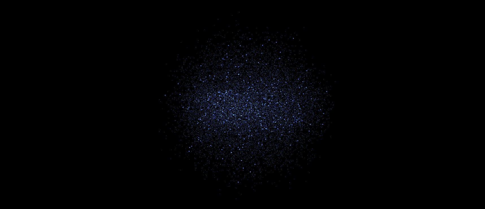

# React Three Fiber FBO particles and normal particles starter (TS + Vite + GLSL support)


A starter template for normal particles and FBO particles using React Three Fiber and TypeScript with built-in GLSL support. built from https://renoiser.github.io/r3f-vite-starter/ boilerplate




## Features

- ⚡️ **Vite** - Lightning fast development environment with instant HMR
- 🎨 **React Three Fiber** - React renderer for Three.js
- 🎁 **Drei** - Useful helpers and fully functional abstractions for R3F
- 🎬 **Post Processing** - Ready-to-use effects and post-processing setup
- 🎛️ **Leva** - Debug GUI controls for quick parameter tweaking
- 📦 **TypeScript** - Type safety and enhanced developer experience
- 🎯 **GLSL Shader Support** - Using vite-plugin-glsl for seamless shader imports
- 🔧 **Hot Module Replacement** - Instant feedback during development
- 🎮 **Controls** - Orbit controls preconfigured for scene navigation
- 📱 **Responsive** - Mobile-friendly and responsive design

## Tech Stack

This boilerplate is powered by:
- [Vite](https://vitejs.dev/) - Next Generation Frontend Tooling
- [vite-plugin-glsl](https://github.com/UstymUkhman/vite-plugin-glsl) - Import GLSL shaders as strings
- [@react-three/drei](https://github.com/pmndrs/drei) - Collection of useful helpers and abstractions
- [@react-three/postprocessing](https://github.com/pmndrs/react-postprocessing) - Post-processing effects for React Three Fiber
- [leva](https://github.com/pmndrs/leva) - React-first GUI controls for creative coding
- [three-stdlib](https://github.com/pmndrs/three-stdlib) - Three.js standard library

## Shader Example

Includes an example of FBO particles and normal particles using React Three Fiber and TypeScript with built-in GLSL support.

## Getting Started

```bash
# Clone the repository
git clone https://github.com/washington/r3f-particle-starter

# Install dependencies using npm or pnpm
npm install
pnpm install
yarn 

# Start development server with npm or pnpm
npm run dev
pnpm dev
yarn dev

```
`react-three-fiber` `typescript` `vite` `threejs` `r3f` `glsl` `shaders` `3d` `webgl` `drei` `react` `postprocessing` `leva` `starter-kit` `boilerplate` `template` `vite-plugin-glsl` `three-stdlib`
